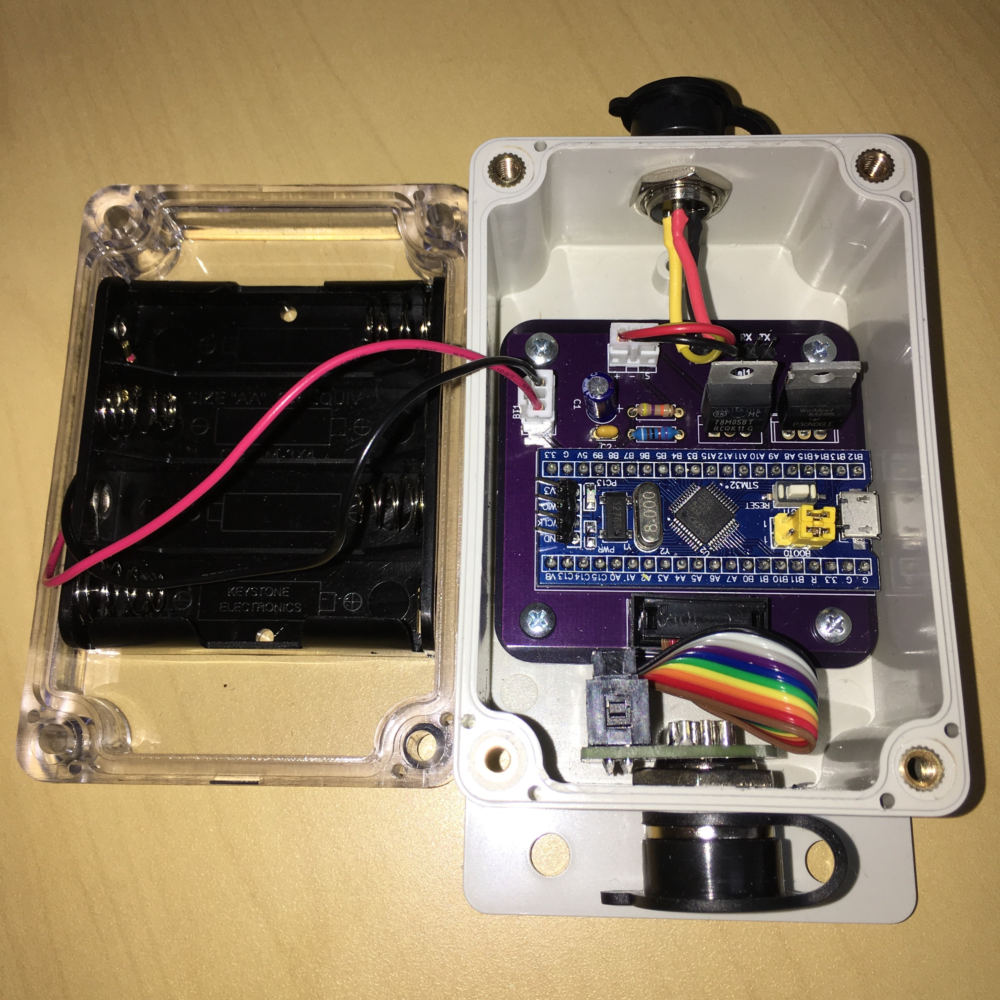
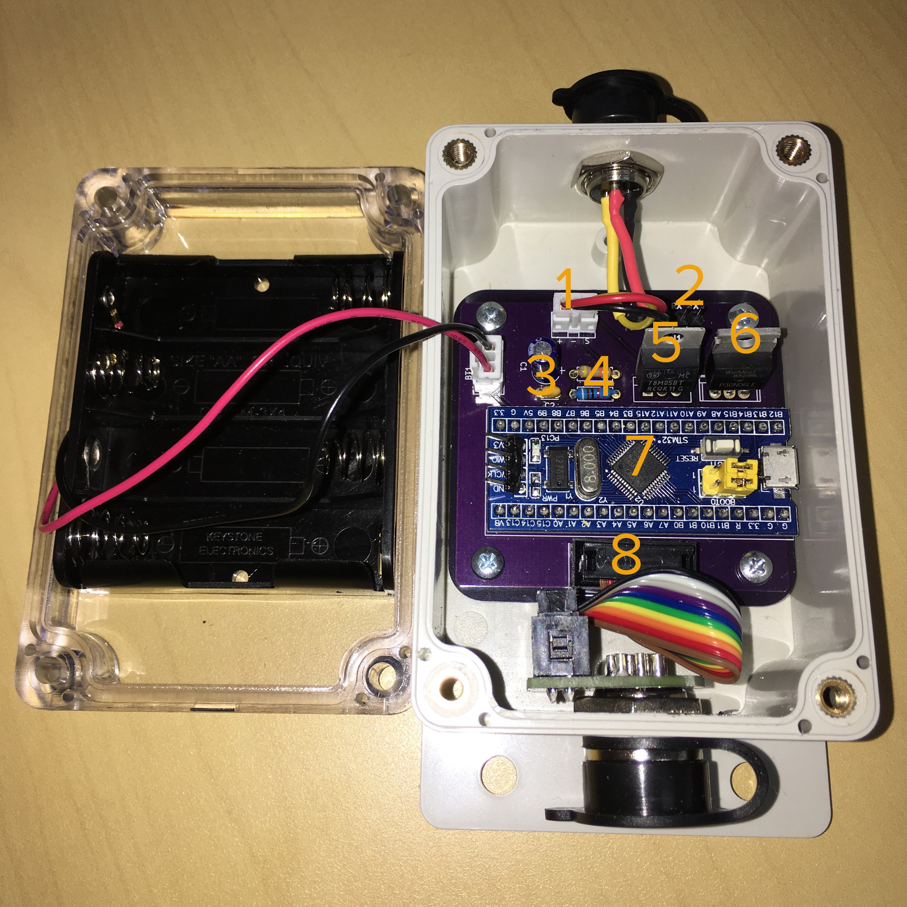

# STMaytal32

STMaytal32 is a new generation proof-of-concept design for water pressure telemetry for underresourced water utilities. It uses a standard automotive oil pressure sender to read pressure and send this to a server where it can inform better operation of a utility. It follows up on the original proof-of-concept designed called Maytal and the designs and iterations that followed from Indonesian innovators supported by a grant from the USAID IUWASH Plus project.

This is just a proof-of-concept and should not be taken to be the right or best way to address the questions raised in the testing of earlier designs. It should be well noted that **as of right now, this code does not actually work**. The function to map the 5V signal from the pressure sender to the 3.3V ADC of the STM32 needs tweaking.

## Design features
STMaytal32 responds to some challenges to scale that were identified in testing some of the earlier water pressure telemetry designs:

* *Modularity*. Earlier designs were integrated into one large box that was sometimes difficult to place near enough to a pipe outlet while still getting power and a communications signal. This led to some installations where very long cords were added to the pressure sender, changing the resistance and increasing the amount of power necessary to drive the sensor. STMaytal32 puts the sensing and computational functions in one box, and the communications function in another, independently powered box. This allows the two to be placed at a distance from one another without interfering with readings or signal (provided the UART signal between the two remains readable). It also enables different communications technologies to be used in different installation contexts.
* *Bill of Materials*. The STMaytal32 design is centered on the "Blue Pill" STM32 development board which is common in Indonesia (IDR 70,000 on Tokopedia) and on the worldwide market (US$1.48 on Aliexpress). The Blue Pill includes an oscillator to drive the onboard RTC peripheral, obviating the need for a separate RTC to wake the unit from sleep. Efforts have been taken to reduce extraneous hardware that would add cost to the design. 
* *Power*. Field placement of earlier designs revealed that in practice, utilities often want to position these units in places such as in manholes or among complex piping systems that do not readily allow for solar or mains power. By using the relatively power-efficient STM32 and eliminating unnecessary hardware, the main module of the STMaytal32 can be powered by 4 AA batteries, which should run the unit for several months before needing replacement. 
* *Communications*. Earlier designs used GSM networks for communications, which, while effective, would impose operating costs and administrative burden for utilities. The communications module described here uses LoRaWAN for communications, which should enable utilities to manage their own simple, inexpensive networks which can also be used to collect data from future sensors.

## Breakdown
### Core module

1. *Voltage regulator*. The regulator on the Blue Pill supplies 3.3V of dubious reliability. This supplies 5V direct from the AA batteries.
2. *Power MOSFET*. Cuts power to the pressure sender while not in use.
3. *Smoothing capacitors*. To reduce variations in supply from the AA batteries.
4. *1x03 connector*. To enable the pressure sender to be easily attached and detached.
5. *Voltage divider*. To convert the 5V signal from the pressure sender to a 3.3V equivalent signal.
6. *1x10 JTAG-style connector*. To connect to a GX16-10 aviation connector on the enclosure, which connects this with the communications module.
7. *"Blue Pill" STM32 development board*. Note that the PWR LED has been desoldered to save power.
8. *Serial1 breakout.* Pins to the STM32's Serial1 port are broken out here to facilitate debugging.

### Communications module

The communications module is just an Adafruit RFM9x LoRa breakout board and an Adafruit Solar LiPo charger board, interfaced with a 1x10 JTAG-style connector to facilitate connection to the core module. More work to source locally-appropriate and less expensive parts is called for in the near future.